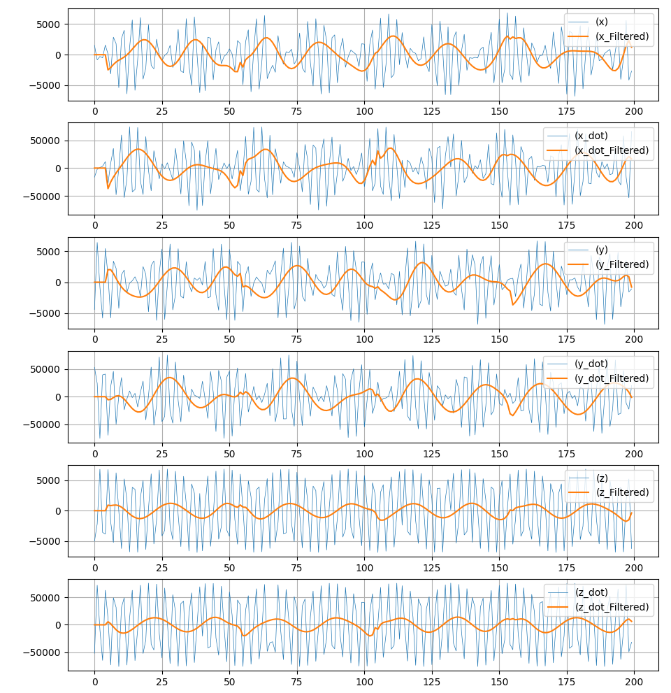
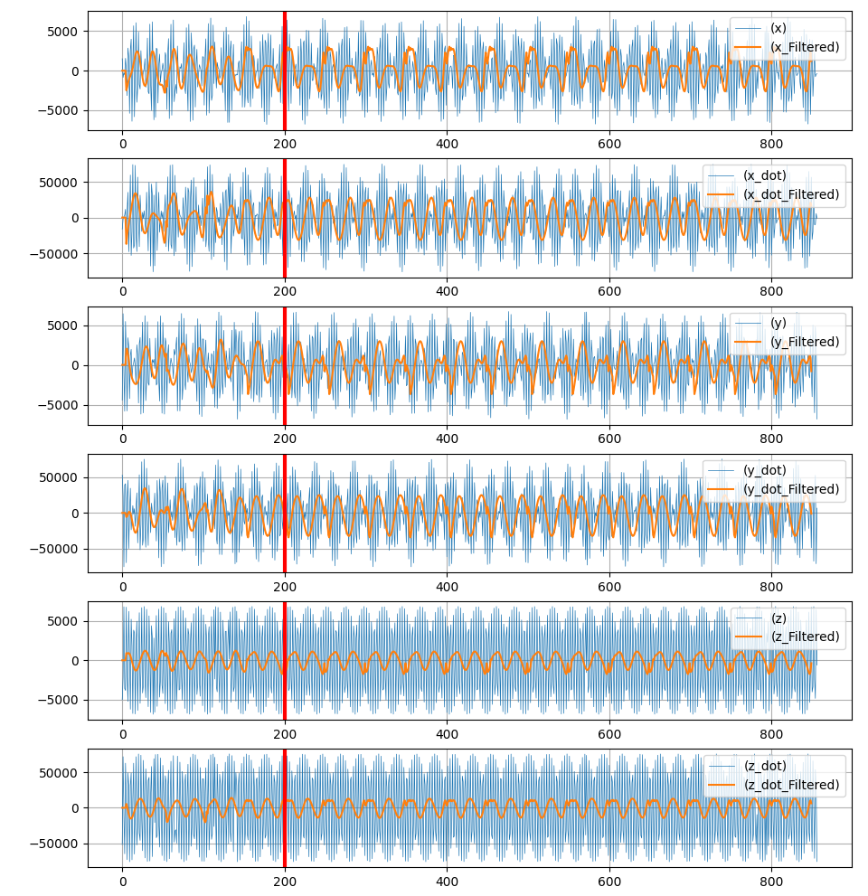
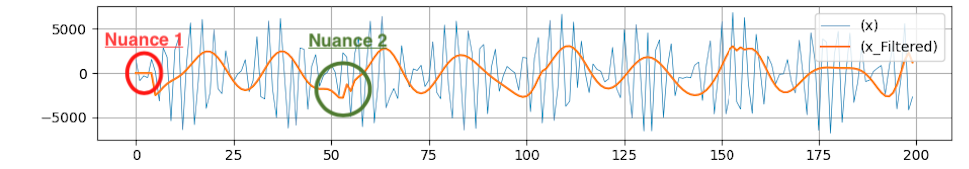

# Filtering The Data

In order to extract the low frequencies from the signals, a lowpass, moving max filter with was applied on the state arrays with a small window size of 5.  The window size was determined visually as being sufficient to reduce away the high frequency components of the signal while not attenuating the low frequency signal significantly.  A polynomial fit was then applied sequentially on the data segments for smoothness.  The polynomial window size used was 50 data points with order 10 polynomial. See Below.

***Figure X***: Shows the smoothed, low pass frequency of each data component.

***Figure Y***: Shows the data propagated forward by two weeks and super imposed over existing data. The red bar indicates the divide between actively filtered data and forward propagated data

Nuances to note.  The method that was used results in a smooth and accurate waveform over the duration of each polynomial window, however certain artifacts bare mentioning.

## Nuance 1
At the areas at the very beginning of the of each plot the, curves were zero-padded in order to make up for "lost" data corresponding to the low-pass window size.

## Nuance 2
There are high frequency artifacts at each joining polynomial fit segment and are due to polynomial fits being ill defined at start and endpoints.  These points may removed, however, were not, as that results in a sizeable data shift over large batches of data.

